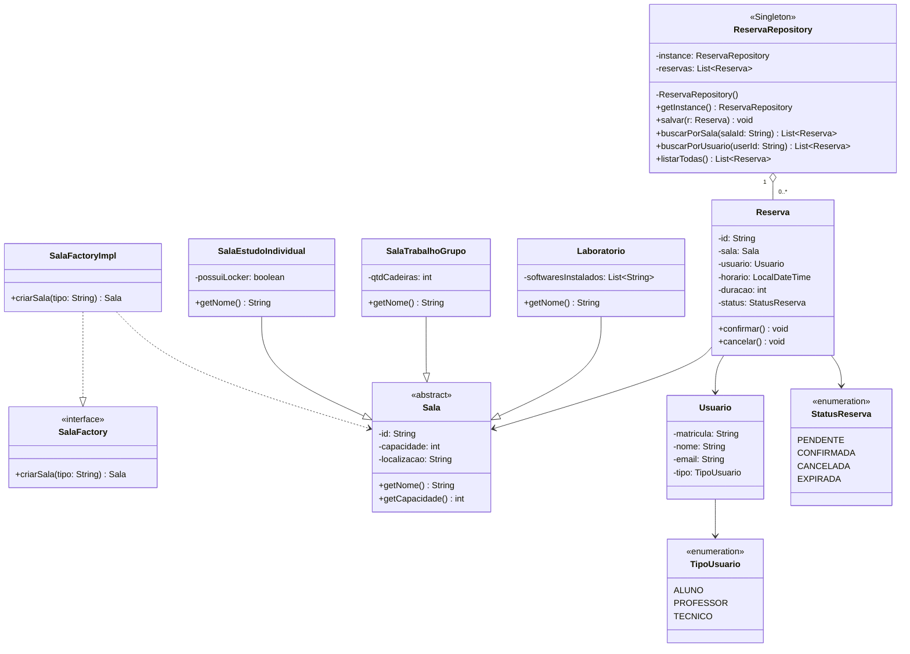
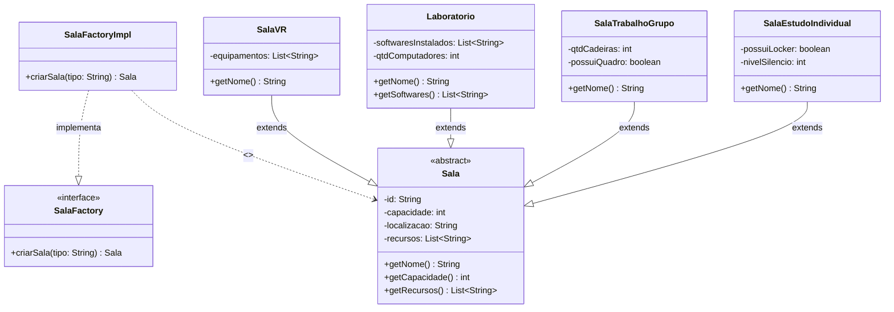
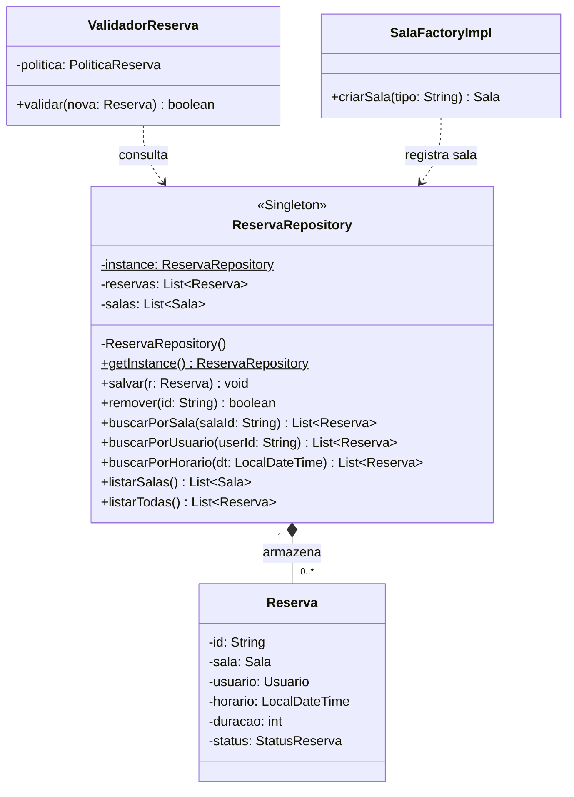
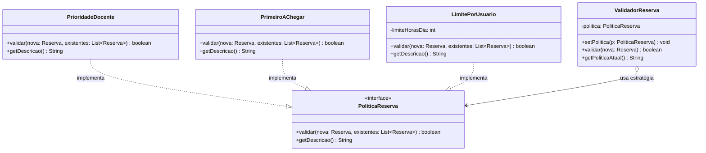
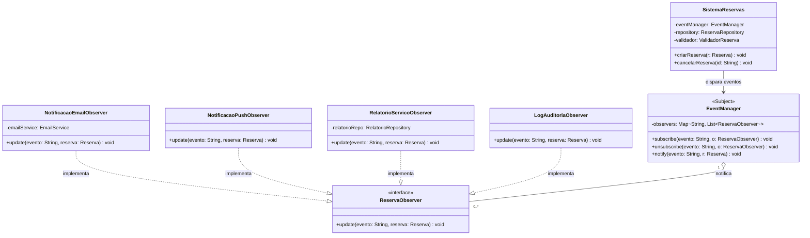
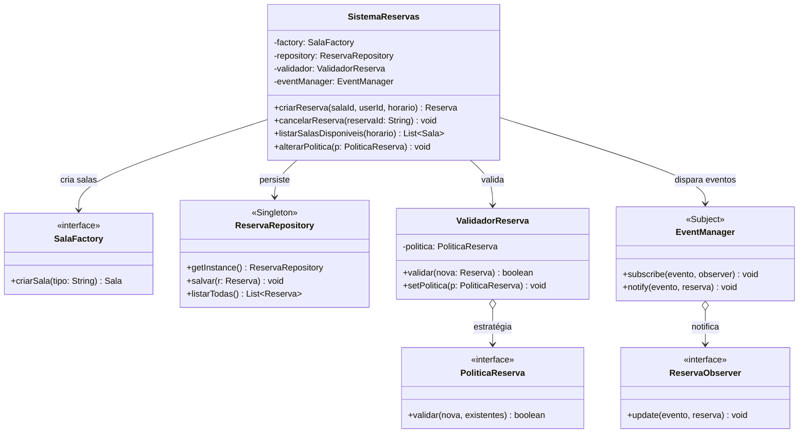

# Diagramas de Classes – Sistema de Reserva de Salas

> Padrões aplicados: **Factory Method · Singleton · Strategy · Observer · Decorator**

---

## 1. Visão Geral do Sistema

---

## 2. Padrão Factory Method – Criação de Salas

---

## 3. Padrão Singleton – Repositório de Reservas

---

## 4. Padrão Strategy – Política de Reserva (RF-03)

---

## 5. Padrão Observer – Notificações (RF-04)

---

---

## 6. Integração Completa – Fluxo Principal

